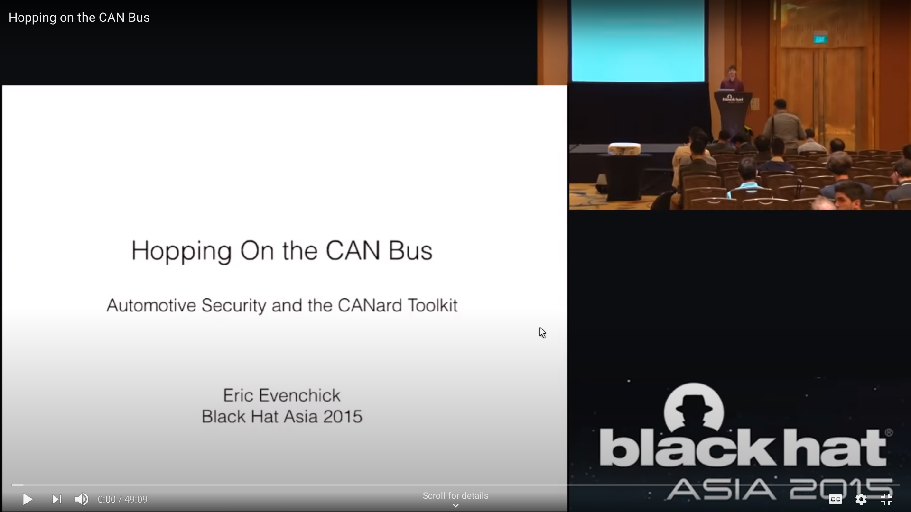
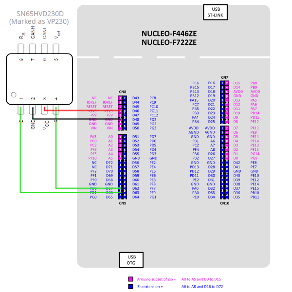
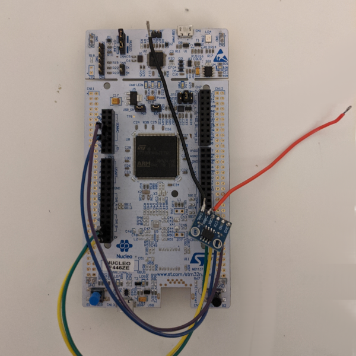

<h1> A Super Simple STM32 SLCAN CANbus Bridge (My Cover Letter to ARM&reg;)</h1>

STM32Fxxx compatibe firmware for a super simple SLCAN USB &harr; CANbus bridge.

 

## Table of Contents
---
- [**Introduction**](#intro)
  - [What is CAN?](#intro1)
  - [Why an STM32 / ARM&reg; MCU?](#intro2)
  - [Why not a BluePill?](#intro3)
- [**Usage**](#usage)
  - [What is SLCAN](#usage1)
  - [LEDs](#usage2)
  - [Minicom](#usage3)
  - [SocketCAN](#usage4)
  - [ISOTP](#usage5)
  - [Python](#usage6)
- [**Examples**](#Examples)
  - [Minicom](#example1)
  - [SocketCAN + Wireshark](#example2)
  - [can-utils + ISOTP](#example3)
  - [Python Server](#example4)

## Introduction

----

### **What is CAN?**
The [CAN (Controller Area Network)](https://en.wikipedia.org/wiki/CAN_bus) bus provides a 'Data Link' and 'Physical' layer for mulitipoint communication over a relatively short distance.

It is designed to be **robust** and **reliable**, and so is used in many industiral applications.
Notably, it is used in the [OBD2](https://en.wikipedia.org/wiki/On-board_diagnostics) and [UDS](https://en.wikipedia.org/wiki/Unified_Diagnostic_Services) diagnostic protocols which in turn are used by all car manufactures.

If you know how to 'hop on the CAN bus', you can apparently do [pretty cool things](https://www.youtube.com/watch?v=U1yecKUmnFo) with your car...

<a target="_blank" href="https://www.youtube.com/watch?v=U1yecKUmnFo">

</a>

 

### **Why an STM32 / ARM&reg; MCU?**
_**Because the whole point of this is so I can get a job at ARM!**_

But also, the STM32Fxxx family of ARM&reg; Cortex&reg; Microcontrollers are cheap, easy to use, and widely accessible. This firmware is written for the [STM32F446ZE Nucleo Board](https://os.mbed.com/platforms/ST-Nucleo-F446ZE/) (+ any CAN transiever. I used [this](https://www.ti.com/product/SN65HVD230)) because that is what I already had, but can easily be ported to a different board...

 

### **Why _not_ a BluePill?**
The BluePill is a cheap and __*very*__ popular dev board for hobbists & hackers. The issue is that it's CAN Rx/Tx are assigned to the same pins as the USB peripheral.

It is, of course, possible to use the UARTs with a USB &harr; UART bridge. If you want to use a BluePill, [check out this project.](https://github.com/walmis/stm32-slcan) 

***To get started, all you need is a board with a 'compatible' STM32 MCU (e.g. a Nucleo Board) and a CAN transiever. Here's my set up:***

  
  

 

## Usage
----

### <u>**What is SLCAN?**</u>
PCs rarely have a CAN bus. They do often have a Serial bus (a universal one, even). SLCAN defines a serial translation of CAN bus frames, as well as some command instructions. I couldn't find a proper 'standard' definition, but I did find [this PDF listing the commands.][6]

This project turns a Nucleo Board into a USB &harr; CAN bridge by translating incoming data from the CAN bus to SLCAN and sending it over USB, and vice versa. Linux provides some utilities for making use of CAN devices, including SLCAN devices.

***The device itself is pretty much Plug&Play, so making use of the firmware comes down to knowing what CAN is, what SLCAN is, and how to use the relevant utilites/libraries.*** 

(Note: To decode the 'MM' 'Get Filter' command corretly, you should know how the Filter & Mask regieristers work internally. *See [[3]] Page 1044*. In short, registers set by left aligning IDs by left-shifting (<<) (32 - ID_LENGTH) places)

### <u>**LEDs**</u>
On the Nucleo F446ZE, there are 3 LEDs: *Red*, *Green* and *Blue*.

- The *Red* LED flashes once when data is sent out to the CAN Bus (Rx from USB, Tx to CAN). It flashes 3 times if there was an error (e.g. Tx mailbox full).
- The *Green* LED flashes once when data is recieved from the CAN Bus (Tx from USB, Rx from CAN).
- The *Blue* LED flashes when a command has been successfully parsed.

When the board is first powered on, it goes through a test sequence. If this test fails, the *Red* LED stays on for 5 seconds. 

### <u>**Minicom**</u>
Once you have the device pluged in, you can send SLCAN commands to the [VCP](https://en.wikipedia.org/wiki/Virtual_COM_port) using whatever program you like (I've tested it with Minicom.) Note that newline characters are not included at the end of a response, only a carrige return. 

### <u>**SocketCAN**</u>
SocketCAN is a set of open source CAN drivers and a networking stack contributed by Volkswagen Research to the Linux kernel. We can use the deamon `slcand` included in [can-utils][5] to create a CAN networking interface (similar to eth0, wlan2, etc.) linked to the SLCAN device. Code can then be written to use the interface like any other networking interface in Linux.

The [can-utils][5] package in Linux provides some examples of tools you can create using the SocketCAN stack. `cansend` and `candump` in partcular are very useful. Check the man pages for usage instructions.

### <u>**ISOTP**</u>
If you want to work with car data, speaking CAN is not enough. You need to be able to send [UDS](https://en.wikipedia.org/wiki/Unified_Diagnostic_Services) and/or [OBD2](https://en.wikipedia.org/wiki/On-board_diagnostics) requests and parse the response. [ISO 15765-2][7] defines a [higher layer](https://en.wikipedia.org/wiki/OSI_model) Transport and Networking protocol that is built on top of the Physical and Data Link layers provided by CAN. This is ISOTP. OBD2/UDS requests and responses are ISOTP packets.

To use the ISOTP utilites, a LKM not included with the standard kernel must be loaded. *(See [[1]])*. After this, can use `isotpdump`, `isotprecv`, and `isotpsniffer` from the [can-utils][5] package to speak ISOTP. Thank you Volkswagen.

### <u>**Python**</u>
There are a couple modules we can use to help us on our car hacking adventure:

- [***sockets***](https://docs.python.org/3/library/socket.html):  The Linux version of Python has native support for SocketCAN interfaces. If know how UNIX sockets work, and how to use the Python stdlib ***sockets*** module, then you can bind a socket to your SLCAN interface from there you can use the socket API as you would normally.
- [***isotp***](https://can-isotp.readthedocs.io/en/latest/index.html): Python doesn't make using ISOTP easy. This module does.
- [***udsoncan***](https://can-isotp.readthedocs.io/en/latest/index.html): I haven't had time to check this out properly, but (as far as I can tell) this is where we get to. Easily sending and recieving complete UDS requests and responses by name. Fully abstacted.

 

## Examples
----
All examples where run on an Acer Aspire A315 and an up-to-date Artix Linux Distribution (except for the client side of Server example.)

#### <u>*Minicom*</u>
(Note: 'Local Echo' & 'Add Newline Character' Options set in Minicom.)

#### <u>*SocketCAN + Wireshark*</u>

#### <u>*can-utils + ISOTP*</u>
(Note: To use the ISOTP utilites, an LKM not included with the standard kernel must be loaded. *See [[1]].* )

#### <u>*Python Server*</u>

 

## Help & Issues
----
- ***Messages seem to be duplicated (especially when in test mode).***  
Messages sent out via a socketCAN interface are locally echoed. I feel like this has something to do with it.  When in test mode, CAN frames are looped back in hardware, on top of the local echo. RAW_CAN sockets in Linux apparently provide a way to disable the software loopback, but I couldn't figure it out. (*See [[2]] Section 4.1.3 for more information.*)
- ***The test always fails.***  
The test will fail unless the device is opened ready to receive the SLCAN data. But the device cannot be opened until the board has powered on. This means I have to power the board, open the Minicom connection, and then restart the board to get a useful test result...TODO
- ***I closed the connection, but transmitted messages still trigger the Red LED.***  
There are 3 Tx Mailboxes. These can be filled while the connection is closed, and then are flushed when the connection is reopened. Adding a message to the Tx mailbox triggers the LED, but it should really trigger when the data is sent to the bus...TODO.
- ***Sometimes sending invalid data 'works', sometimes it doesn't.***  
If whatever happens to be in the 'SLCAN_CommandStrRx' buffer is valid when the next carrige return is seen, then the string gets parsed, even if you didn't put that data there...TODO.

## References
1) https://github.com/hartkopp/can-isotp (can-isotp Kernel Module Github Repo)
2) https://www.kernel.org/doc/Documentation/networking/can.txt (SocketCAN Kernel Documatation)
3) https://www.st.com/resource/en/reference_manual/dm00135183-stm32f446xx-advanced-arm-based-32-bit-mcus-stmicroelectronics.pdf (D0390: STM32F446xx Reference Manual)
4) https://en.wikipedia.org/wiki/SocketCAN (SocketCAN Wikipedia)
5) https://github.com/linux-can/can-utils#socketcan-userspace-utilities-and-tools (can-utils Github Repo)
6) http://www.can232.com/docs/can232_v3.pdf (LAWICEL SLCAN Commands)
7) https://en.wikipedia.org/wiki/ISO_15765-2 (ISO 15765-2 Wikipedia)

[1]: https://github.com/hartkopp/can-isotp (can-isotp Kernel Module Github Repo)
[2]: https://www.kernel.org/doc/Documentation/networking/can.txt (SocketCAN Kernel Documatation)
[3]: https://www.st.com/resource/en/reference_manual/dm00135183-stm32f446xx-advanced-arm-based-32-bit-mcus-stmicroelectronics.pdf (D0390: STM32F446xx Reference Manual)
[4]: https://en.wikipedia.org/wiki/SocketCAN (SocketCAN Wikipedia)
[5]: https://github.com/linux-can/can-utils#socketcan-userspace-utilities-and-tools (can-utils Github Repo)
[6]: http://www.can232.com/docs/can232_v3.pdf (LAWICEL SLCAN Commands)
[7]: https://en.wikipedia.org/wiki/ISO_15765-2 (ISO 15765-2 Wikipedia)

